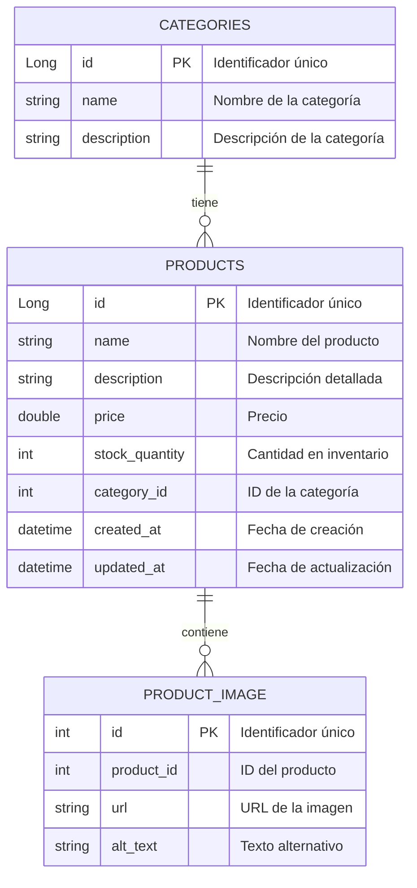

```mermaid
erDiagram
    CATEGORIES {
        Long id PK "Identificador único"
        string name "Nombre de la categoría"
        string description "Descripción de la categoría"
    }
    PRODUCTS {
        Long id PK "Identificador único"
        string name "Nombre del producto"
        string description "Descripción detallada"
        double price "Precio"
        int stock_quantity "Cantidad en inventario"
        int category_id "ID de la categoría"
        datetime created_at "Fecha de creación"
        datetime updated_at "Fecha de actualización"
    }
    PRODUCT_IMAGE {
        int id PK "Identificador único"
        int product_id "ID del producto"
        string url "URL de la imagen"
        string alt_text "Texto alternativo"
    }

    CATEGORIES||--o{ PRODUCTS : "tiene"
    PRODUCTS ||--o{ PRODUCT_IMAGE : "contiene"

```